# Atom App Icons  
   
 A project for custom [Atom](https://atom.io) Icons. All Rights Reserved with [Github](https://github.com) and the respective owners of the themes I am using.
 Inspired from [vscode-icons](https://github.com/dhanishgajjar/vscode-icons), a similar project for [Visual Studio Code](https://code.visualstudio.com/) by [@dhanishgajjar](https://github.com/dhanishgajjar/)
 
 ## Available Icons
 Total Icons Available: 601
 
### Material Series
 These icons were contributed by: [@haideralipunjabi](https://github.com/haideralipunjabi)  

 Icons in this series: 19

                 
### Social Media Series
 These icons were contributed by: [@haideralipunjabi](https://github.com/haideralipunjabi)  

 Icons in this series: 8

         
### Popular Themes
 These icons were contributed by: [@haideralipunjabi](https://github.com/haideralipunjabi)  

 Icons in this series: 14

               
### Citylights
 These icons were contributed by: [@noudadrichem](https://github.com/noudadrichem)  

 Icons in this series: 2

   
### Harry Potter
 These icons were contributed by: [@haideralipunjabi](https://github.com/haideralipunjabi)  

 Icons in this series: 9

          
### Flags of Countries
 These icons were contributed by: [@haideralipunjabi](https://github.com/haideralipunjabi)  

 Icons in this series: 300

                 
### Popular Websites
 These icons were contributed by: [@maticbasle](https://github.com/maticbasle)  

 Icons in this series: 10

           
### Apps
 These icons were contributed by: [@haideralipunjabi](https://github.com/haideralipunjabi)  

 Icons in this series: 8

         
### [The Coding Train](http://thecodingtrain.com/)
 These icons were contributed by: [@haideralipunjabi](https://github.com/haideralipunjabi)  

 Icons in this series: 8

         
### English Premier League
 These icons were contributed by: [@haideralipunjabi](https://github.com/haideralipunjabi)  

 Icons in this series: 65

                 
### La Liga
 These icons were contributed by: [@haideralipunjabi](https://github.com/haideralipunjabi)  

 Icons in this series: 30

                 
### Avatar
 These icons were contributed by: [@Tsardines](https://github.com/Tsardines)  

 Icons in this series: 4

     
### Star Wars
 These icons were contributed by: [@TileThePlane](https://github.com/TileThePlane)  

 Icons in this series: 3

    
### Video Games
 These icons were contributed by: [@maticbasle](https://github.com/maticbasle)  

 Icons in this series: 10

           
### Marvel
 These icons were contributed by: [@haideralipunjabi](https://github.com/haideralipunjabi)  

 Icons in this series: 2

   
### No Color
 These icons were contributed by: [@nextstepAR](https://github.com/nextstepAR)  

 Icons in this series: 5

  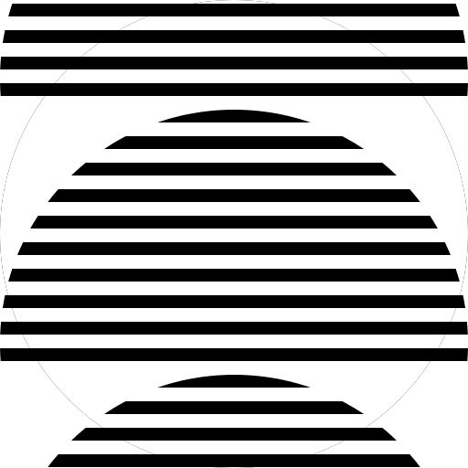    
### Planets
 These icons were contributed by: [@ejilee](https://github.com/ejilee)  

 Icons in this series: 8

         
### Primary
 These icons were contributed by: [@peakgeek](https://github.com/peakgeek)  

 Icons in this series: 6

 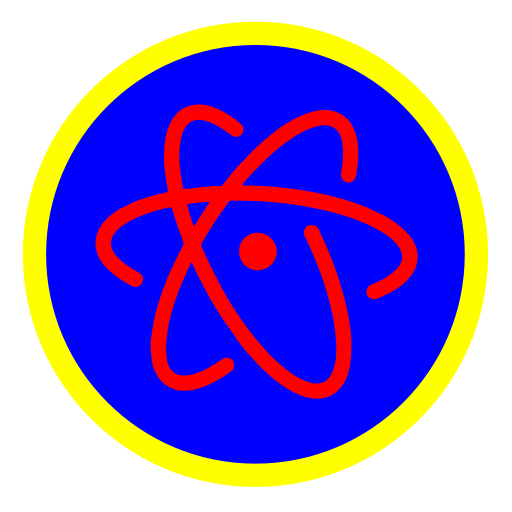 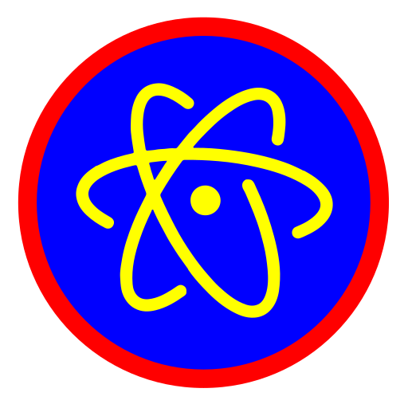 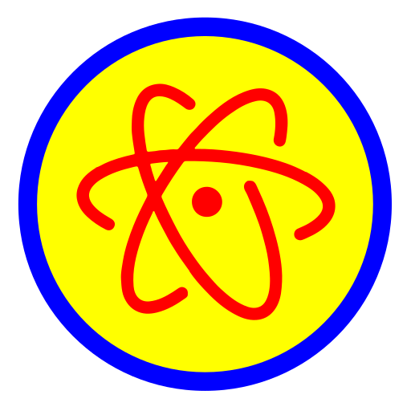 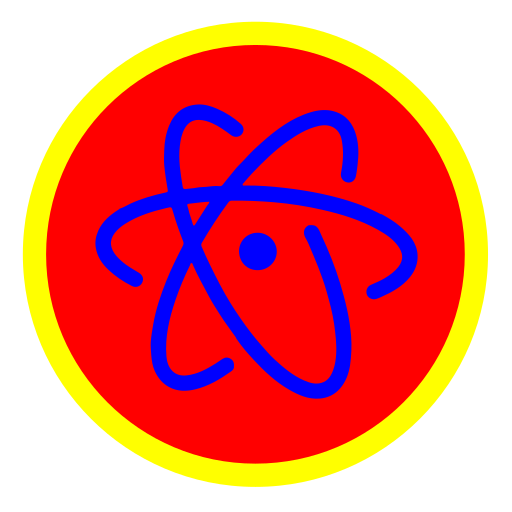 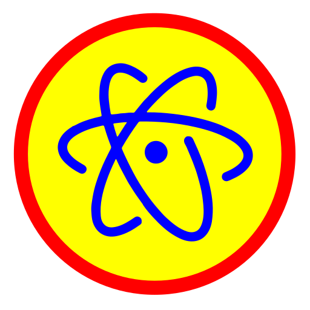 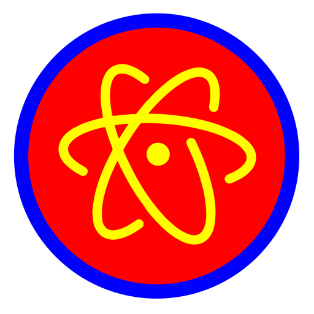 
### Pride
 These icons were contributed by: [@CaelanBorowiec](https://github.com/CaelanBorowiec)  

 Icons in this series: 4

     
### LigaMX
 These icons were contributed by: [@estudioChispa](https://github.com/estudioChispa)  

 Icons in this series: 19

        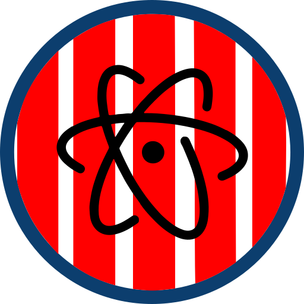 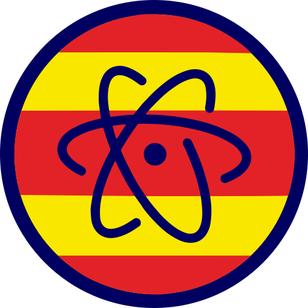       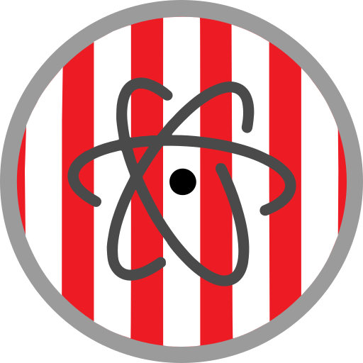 
### Pantone
 These icons were contributed by: [@t-howell](https://github.com/t-howell)  

 Icons in this series: 3

    
### NFL
 These icons were contributed by: [@MichaelCduBois](https://github.com/MichaelCduBois)  

 Icons in this series: 32

                 
### Indian Premier League
 These icons were contributed by: [@frostcover](https://github.com/frostcover)  

 Icons in this series: 8

         
### Atomay
 These icons were contributed by: [@jerryshueh](https://github.com/jerryshueh)  

 Icons in this series: 4

  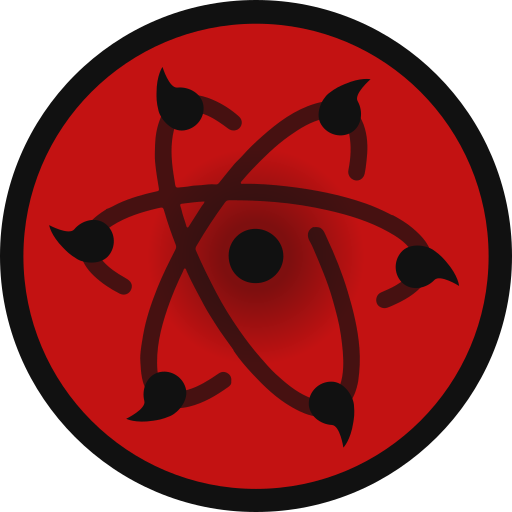   
### iOS System
 These icons were contributed by: [@rogonzalez](https://github.com/rogonzalez)  

 Icons in this series: 9

          
### Others
           
 
 ## Non Series Contributions
 * [@haideralipunjabi](https://github.com/haideralipunjabi)
     * [blackonwhite](svg/blackonwhite.svg)
     * [whiteonblack](svg/whiteonblack.svg)
 * [epl_Tottenham-Hotspur-2](svg/epl_Tottenham-Hotspur-2.svg) by [@bvwells](https://github.com/bvwells)
 * [fade-to-black](svg/fade-to-black.svg) by [@TileThePlane](https://github.com/TileThePlane)
 * [@BrendanCarlin](https://github.com/BrendanCarlin)
     * [black-on-gradient-blue](svg/black-on-gradient-blue.svg)
     * [blue-on-white](svg/blue-on-white.svg)
     * [white-on-orange](svg/white-on-orange.svg)
 * [@AlexandruValeanu](https://github.com/AlexandruValeanu)
     * [laliga_Sevilla-FC-1](svg/laliga_Sevilla-FC-1.svg)
     * [laliga_Sevilla-FC-2](svg/laliga_Sevilla-FC-2.svg)
     * [laliga_Sevilla-FC-3](svg/laliga_Sevilla-FC-3.svg)
 * [@RAFAELDEV2016](https://github.com/RAFAELDEV2016)
     * [Blue](svg/Blue.svg)
     * [Red](svg/Red.svg)
 * [Penstand](svg/Penstand.svg) by [@Dipanjan9](https://github.com/Dipanjan9)
 * [flag_Philippines-2](svg/flag_Philippines-2.svg) by [@kristm](https://github.com/kristm)
 * [green-alien](svg/green-alien.svg) by [@Sporandum](https://github.com/Sporandum)
 * [flag_India-3](svg/flag_India-3.svg) by [@Akashd7](https://github.com/Akashd7)
 * [flag_Brazil](svg/flag_Brazil.svg) by [@kevinwsbr](https://github.com/kevinwsbr)
 
 
 ## Additional Resources
 * The Flags of Countries were generated using [Atom Flag Icons Generator](https://gist.github.com/haideralipunjabi/b072aa4a8e28a78392e7e83b18575d2b)
 * The Football/Soccer League Icons were generated using [Atom Football Icons Generator](https://gist.github.com/haideralipunjabi/74ef6131e6602617d8d442d2a8c2e1b2)  
 
 ## How to Contribute
 
 ### Making Icons
 * You only need to submit an SVG file per icon, other formats will be generated using CI.
 * You may use [icon.svg](icon.svg) or any other SVG file from the repository as a base/reference.
 * Make sure the `width` & `height` attributes are removed from the SVG, as they cause problems when resizing the SVG into other formats.
 * Ideal size for the icon is `512x512`  
 
 ### Naming Guidelines
 * If you are submitting icons as part of a series, make sure to name it like `seriesname_iconname.svg`. No other `underscore (_)` should be used.
 * If you are submitting the icon without it being a part of any series, make sure to name it without any `underscore (_)`.
 
 ### Notes
 * You don't need to edit the README.md, as it is auto generated using CI.
 
 
 ## How to Install
 
 **Mac OS:**
 
 Download [Image2Icon](http://www.img2icnsapp.com/) app. Drop the  `svg` as source and export a `ICNS` file.
 
 The easiest way to change the icons is by using https://freemacsoft.net/liteicon/. Just Drag and Drop the custom icon and hit `Apply Changes`.
 
 Copy the `.icns` file you'd like to use. Find VS Code in your Applications folder, right click the icon and select `Get Info`. Click the icon in the top right corner so that a blue highlight appears around it. `⌘ + V` to paste the new icon in. It may take a few restarts of VS Code for the icon to take.
 
 If for some reason that doesn't work, then dragging the `.icns` to the icon (in the top left) of the info pane, until you see the green plus sign and then dropping it works.
 
 **Windows:**
 
 Right click on the shortcut App Icon, select properties and then shortcut tab and then `change icon` button.
 
 **Linux:**  
 
 It is distribution dependent. Google how to do it. If you can't, open an Issue, or [mail me](mailto:haideralipunjabi@hackesta.org)

