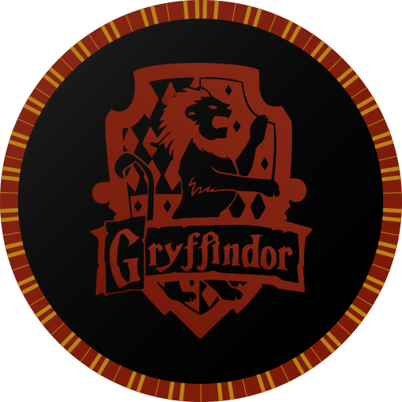
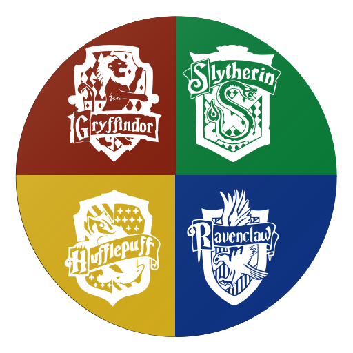
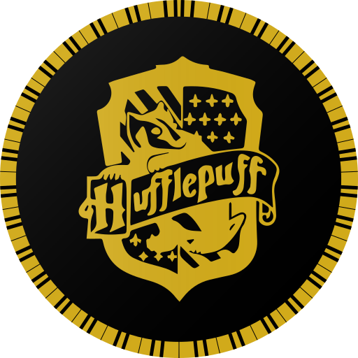
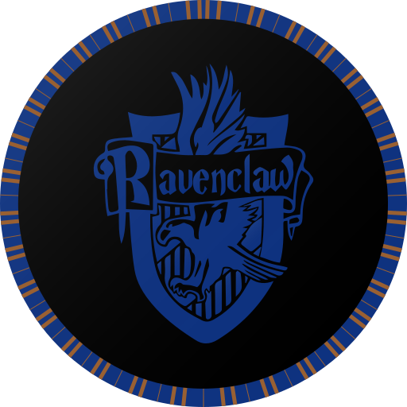
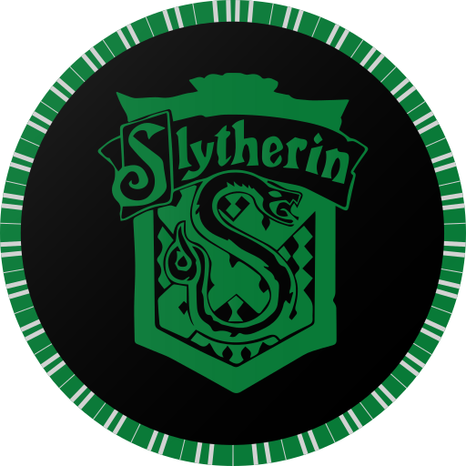
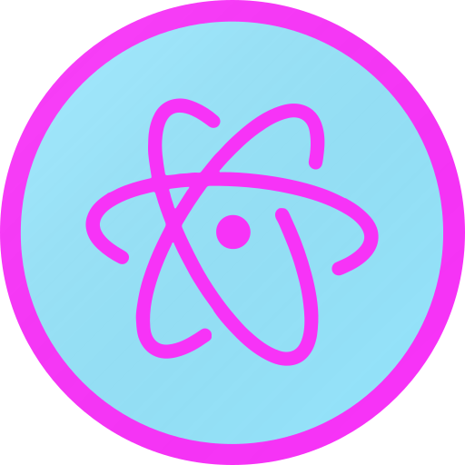
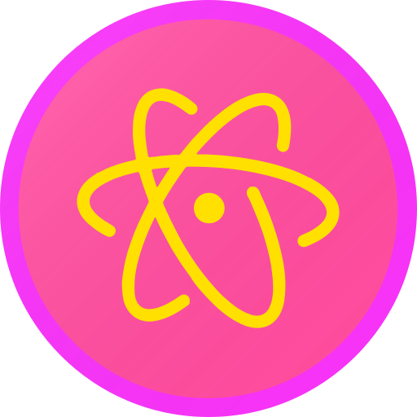
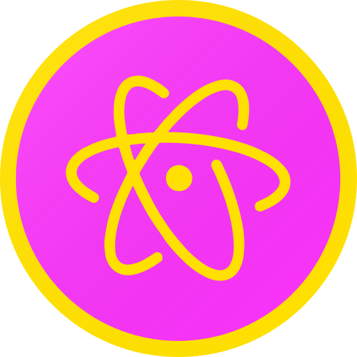
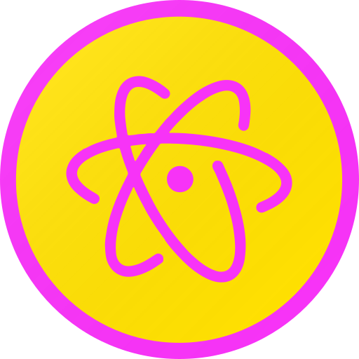

# Atom App Icons  
   
 A project for custom [Atom](https://atom.io) Icons. All Rights Reserved with [Github](https://github.com) and the respective owners of the themes I am using.
 Inspired from [vscode-icons](https://github.com/dhanishgajjar/vscode-icons), a similar project for [Visual Studio Code](https://code.visualstudio.com/) by [@dhanishgajjar](https://github.com/dhanishgajjar/)
 
 ## Available Icons
 Total Icons Available: 461
 
### Material Series
 These icons were contributed by: [@haideralipunjabi](https://github.com/haideralipunjabi)  

 Icons in this series: 19

                 
### Social Media Series
 These icons were contributed by: [@haideralipunjabi](https://github.com/haideralipunjabi)  

 Icons in this series: 8

         
### Popular Themes
 These icons were contributed by: [@haideralipunjabi](https://github.com/haideralipunjabi)  

 Icons in this series: 14

               
### Citylights
 These icons were contributed by: [@noudadrichem](https://github.com/noudadrichem)  

 Icons in this series: 2

   
### Harry Potter
 These icons were contributed by: [@haideralipunjabi](https://github.com/haideralipunjabi)  

 Icons in this series: 9

          
### Flags of Countries
 These icons were contributed by: [@haideralipunjabi](https://github.com/haideralipunjabi)  

 Icons in this series: 299

                 
### Gitlab
 These icons were contributed by: [@maticbasle](https://github.com/maticbasle)  

 Icons in this series: 2

   
### Apps
 These icons were contributed by: [@haideralipunjabi](https://github.com/haideralipunjabi)  

 Icons in this series: 7

        
### [The Coding Train](http://thecodingtrain.com/)
 These icons were contributed by: [@haideralipunjabi](https://github.com/haideralipunjabi)  

 Icons in this series: 8

         
### English Premier League
 These icons were contributed by: [@haideralipunjabi](https://github.com/haideralipunjabi)  

 Icons in this series: 64

                 
### La Liga
 These icons were contributed by: [@haideralipunjabi](https://github.com/haideralipunjabi)  

 Icons in this series: 27

                 
### Others
   
 
 ## Additional Resources
 * The Flags of Countries was generated using [Atom Flag Icons Generator](https://gist.github.com/haideralipunjabi/b072aa4a8e28a78392e7e83b18575d2b)
 * The English Premier League Icons were generated using [Atom EPL Icons Generator](https://gist.github.com/haideralipunjabi/74ef6131e6602617d8d442d2a8c2e1b2)  
 
 ## How to Contribute
 
 ### Making Icons
 * You only need to submit an SVG file per icon, otehr formats will be generated using CI.
 * You may use [icon.svg](icon.svg) or any other SVG file from the repository as a base/reference.
 * Make sure the `width` & `height` attributes are removed from the SVG, they cause problems when resizing the SVG into other formats.
 * Ideal size for the icon is `512x512`  
 
 ### Naming Guidelines
 * If you are submitting the icon as part of a series, make sure to name it like `seriesname_iconname.svg`. No other `underscore (_)` should be used.
 * If you are submitting the icon without it being a part of any series, make sure to name it without any `underscore (_)`.
 
 ### Notes
 * You don't need to edit the README.md, as it is auto generated using CI.
 
 
 ## How to Install
 
 **Mac OS:**
 
 Download [Image2Icon](http://www.img2icnsapp.com/) app. Drop the  `svg` as source and export a `ICNS` file.
 
 Easiest way to change the icons is by using https://freemacsoft.net/liteicon/. Just Drag and Drop the custom icon and hit `Apply Changes`.
 
 Copy the `.icns` file you'd like to use. Find VS Code in your Applications folder, right click the icon and select `Get Info`. Click the icon in the top right corner so that a blue highlight appears around it. `⌘ + V` to paste the new icon in. It may take a few restarts of VS Code for the icon to take.
 
 If for some reason that doesn't work, then dragging the `.icns` to the icon (in the top left) of the info pane, until you see the green plus sign and then dropping it works.
 
 **Windows:**
 
 Right click on the shortcut App Icon, select properties and then shortcut tab and then `change icon` button.
 
 **Linux:**  
 
 It is distribution dependent. Google how to do it. If you can't, open an Issue, or [mail me](mailto:haideralipunjabi@hackesta.org)

